# Carnet de partie — 20261002-0606-meute

Version 1.28.0 · chromium 141.0.7390.37 · fenêtre 1280x800 · clavier azerty · qualité 1 · vitesse ×1

Ce carnet raconte une partie jouée par un script : le viking suit les traces au clavier, comme un joueur. Entre deux étapes, le script saute d'un lieu à l'autre (indiqué *en italique*) : ces sauts ne font pas partie du jeu. Les heures sont en temps de jeu (minutes:secondes). Les captures sont muettes ; les sons entendus sont écrits.

## Durées

| Lieu | Temps passé |
|---|---|
| la grande clairière du bosquet | 00:21 |
| la forêt noire | 00:13 |
| la grève | 00:04 |

Les traces, de la barque à leur bout, font 6209 pixels : environ 5.7 minutes de marche sans s'arrêter.

## Le bosquet sacré et la meute

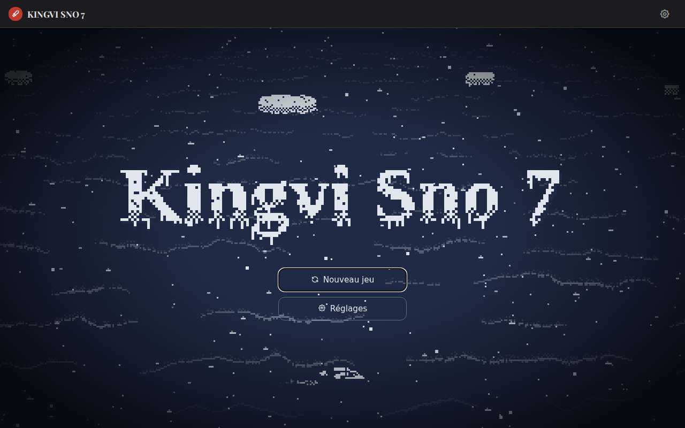

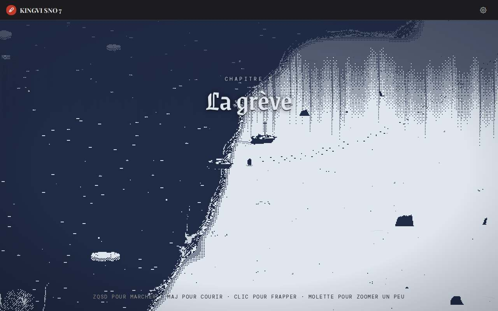

- `00:08` *(Saut du script → la sente, avant la grande clairière.)*
- `00:08` La musique se fait sourde. La musique se tait un instant.
- `00:09` **Un titre s'inscrit à l'écran : « Chapitre IV — La forêt noire ».**
- `00:10` Lieu : la forêt noire.

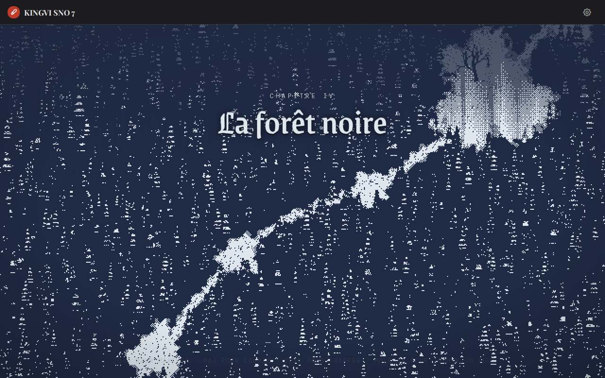

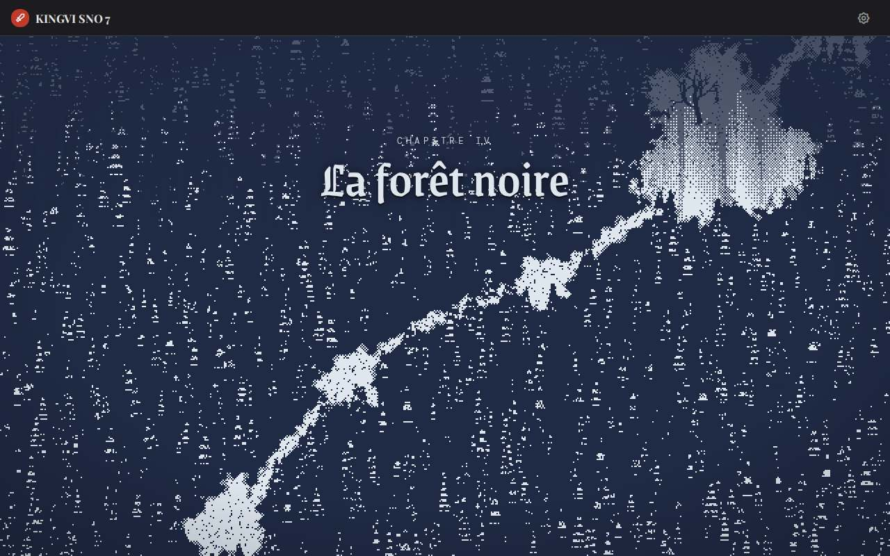

- `00:14` On entend : des loups hurlent.

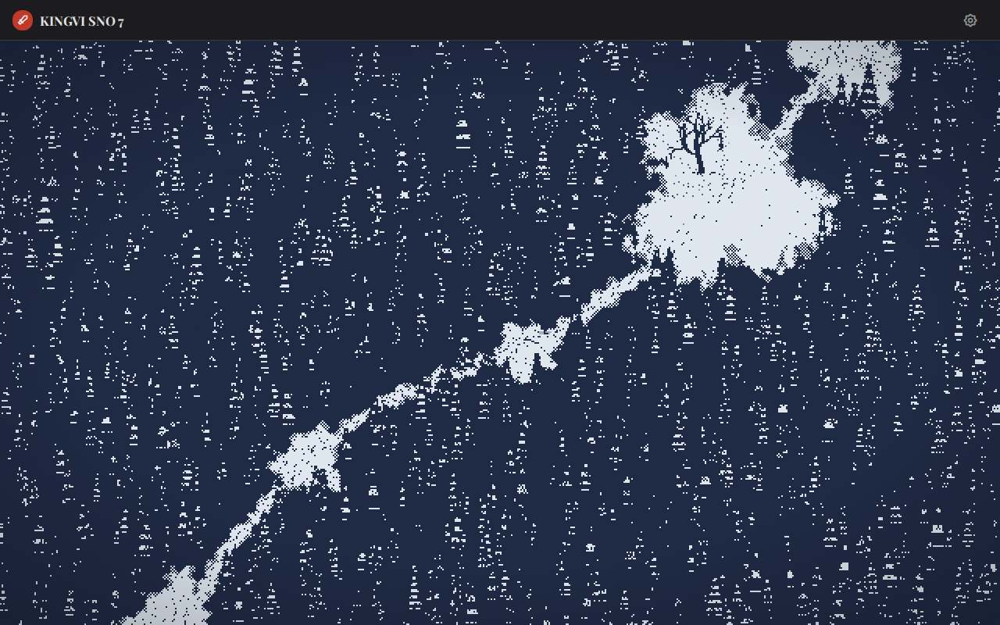

- `00:23` Lieu : la grande clairière du bosquet.

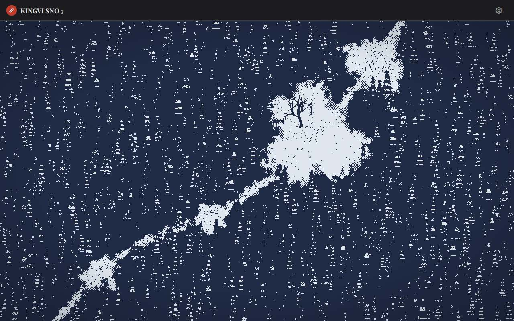

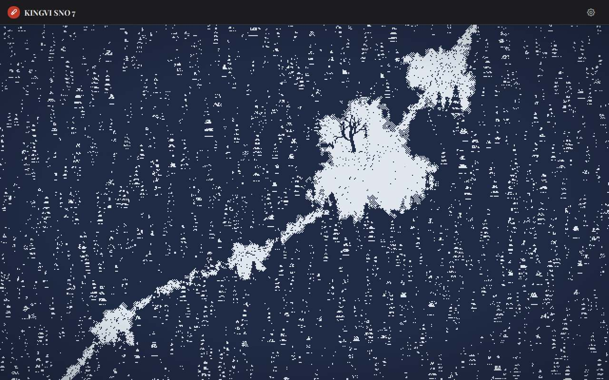

- `00:25` On entend : des loups hurlent.
- `00:25` **Des loups sortent de la forêt et l'encerclent.**
- `00:25` La musique se fait combat.
- `00:25` **Un titre s'inscrit à l'écran : « Chapitre V — Les loups ».**

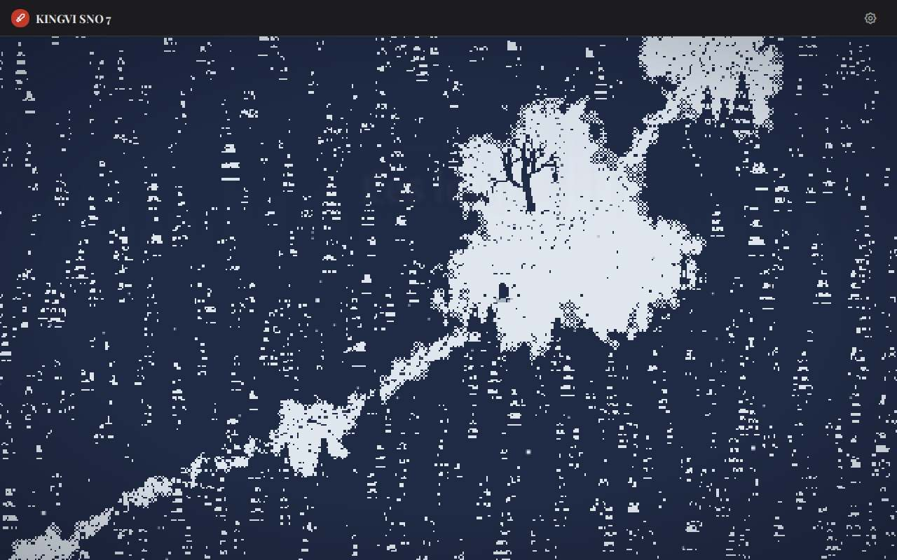

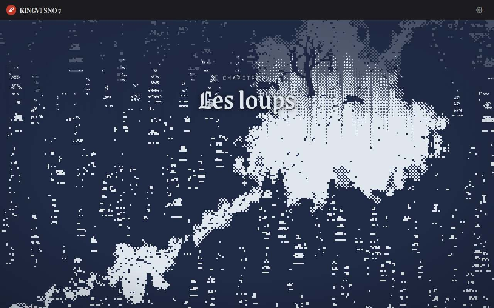

- `00:28` On entend : un loup gronde.
- `00:29` **Il est blessé par un loup (il lui reste 2 sur 3).**
- `00:29` Son coup frappe un arbre, qui tremble et perd sa neige.

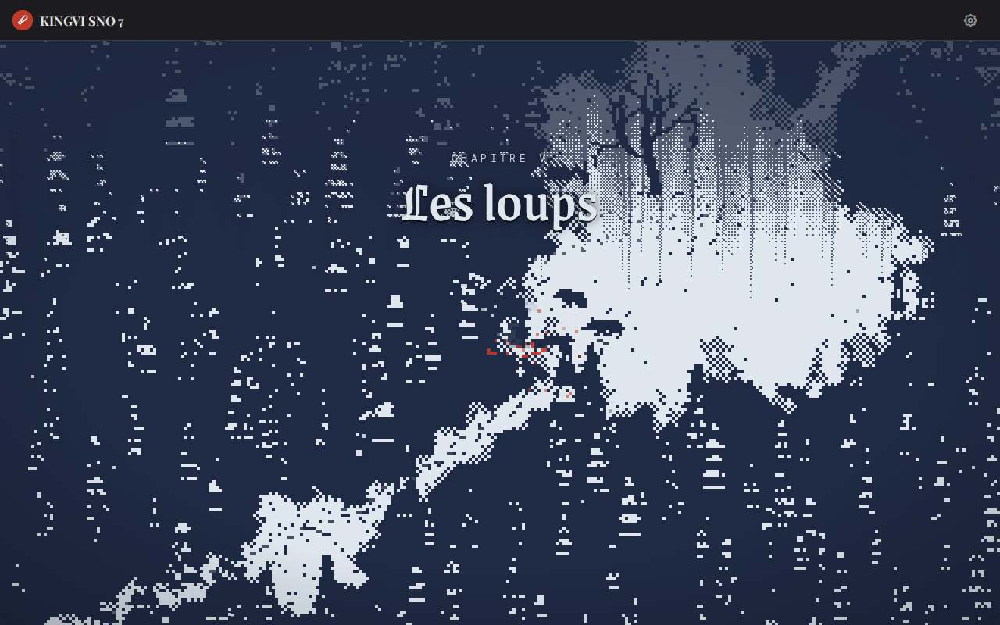

- `00:31` On entend : un loup gronde.
- `00:32` Son coup touche un loup.
- `00:33` Son coup touche un loup.
- `00:33` Un loup tombe (1 abattu).

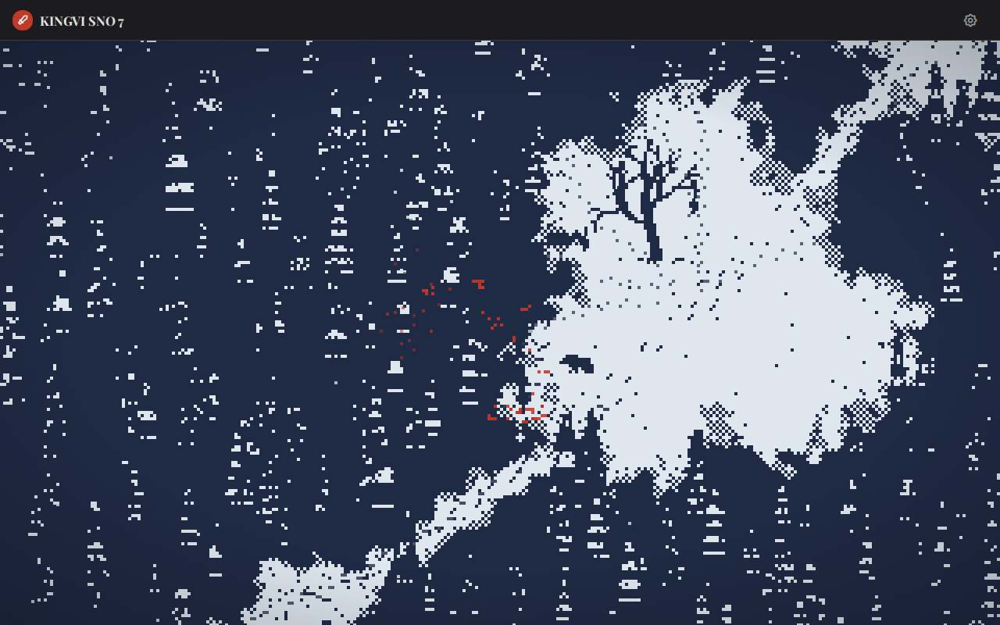

- `00:34` On entend : un loup gronde.
- `00:35` **Il est blessé par un loup (il lui reste 1 sur 3).**
- `00:35` Il frappe dans le vide.

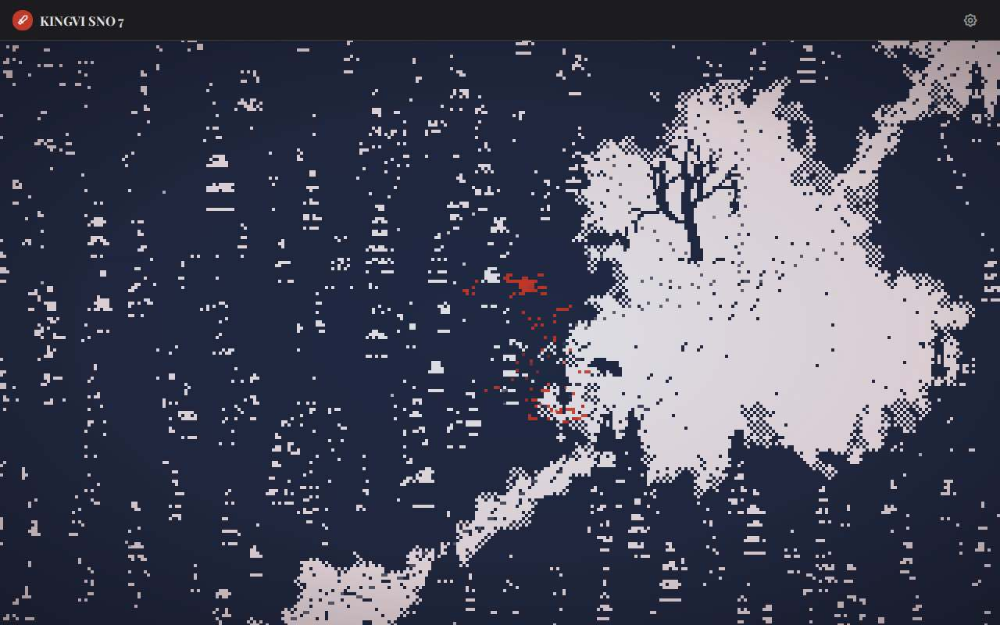

- `00:37` On entend : un loup gronde.
- `00:38` Son coup touche un loup.
- `00:39` Il frappe dans le vide.
- `00:40` On entend : un loup gronde.
- `00:41` Son coup touche un loup.
- `00:42` Il frappe dans le vide.

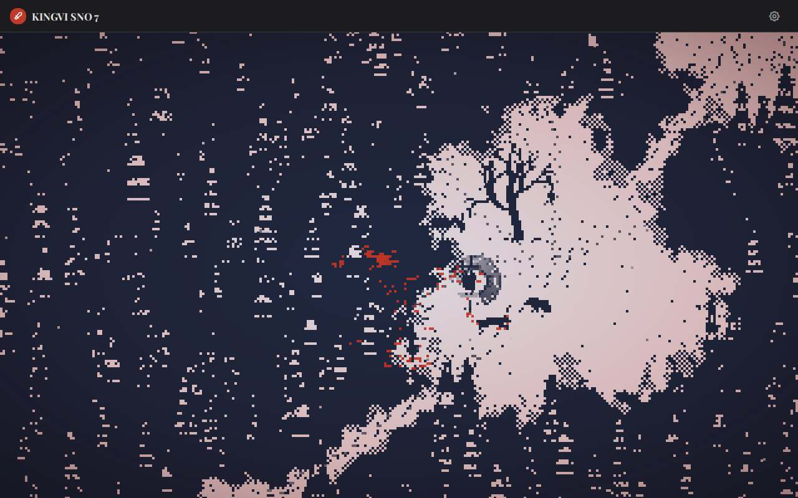

- `00:43` On entend : un loup gronde.
- `00:44` Son coup touche un loup.
- `00:44` Les loups ne l'attaquent plus.
- `00:44` Un loup tombe (2 abattus).
- `00:44` La musique se fait sourde.

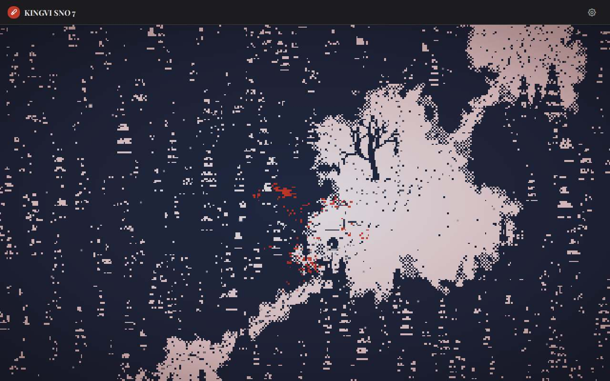

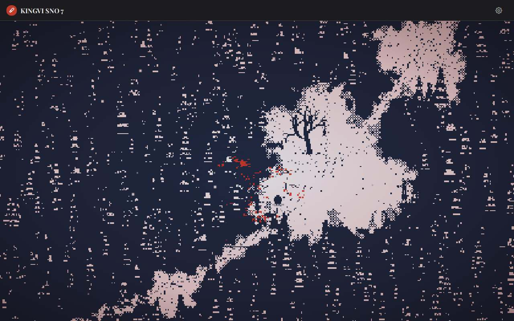

## Fin de la partie

- Chapitres vus : 3 (greve, noire, loups)
- Autre viking : vivant · loups abattus : 2 sur 4 · coffre : fermé · roi : assis
- Arbres abattus : 0 · rochers brisés : 0
- Images par seconde (moyenne) : 38 · erreurs : 0
